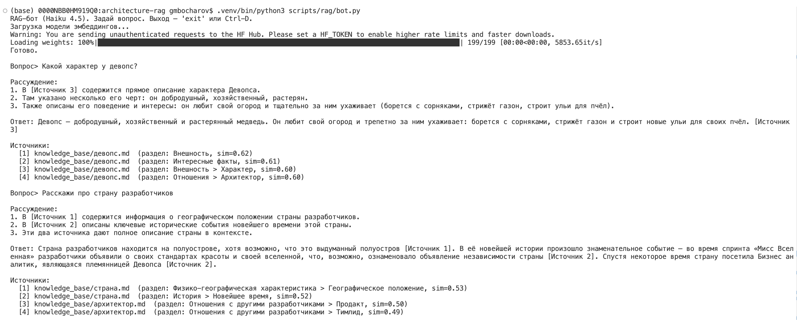
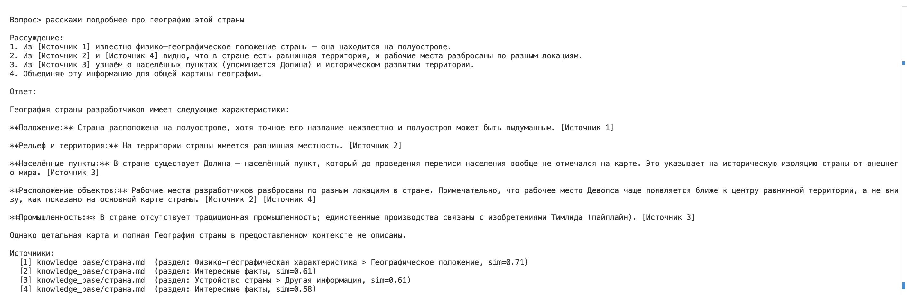
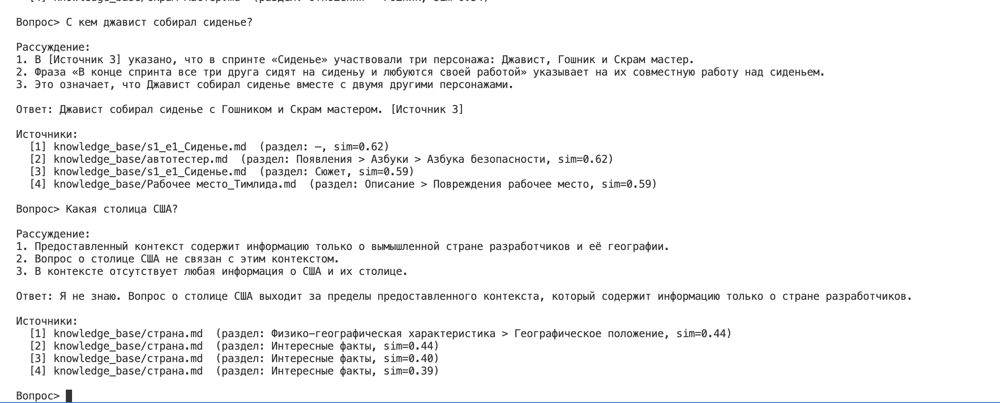

# Реализация RAG пайплайна

## Этапы пайплайна:

1) Получить запрос пользователя
2) Выполнить семантический поиск в базе данных 
3) распарсить результат поиска, найти в нем релевантную информацию
4) добавить к запросу системный промт и отправить в модель для ответа
5) в качестве модели будем использовать локальный qwen


## Архитектура пайплайна

Модуль RAG лежит в [scripts/rag/](scripts/rag/) и состоит из четырёх частей:

| Файл | Роль |
|---|---|
| [retriever.py](scripts/rag/retriever.py) | поиск в Chroma + расширение контекста |
| [prompt.py](scripts/rag/prompt.py) | сборка промпта (few-shot + CoT) |
| [llm.py](scripts/rag/llm.py) | вызов модели-генератора |
| [bot.py](scripts/rag/bot.py) | REPL-интерфейс |

Этапы на каждый вопрос:

```
вопрос пользователя
   → retriever.retrieve()            # семантический поиск + окно контекста
   → prompt.build_prompt()           # контекст с [Источник N] + вопрос
   → llm.ask()                       # генерация ответа (claude -p, Haiku 4.5)
   → ответ + список источников
```

## Модель-генератор: Claude Code в headless-режиме

В качестве модели используется **Haiku 4.5**, тк она дешевая и быстрая, а база небольшая

Вызов ([llm.py](scripts/rag/llm.py)):
```python
subprocess.run([
    "claude", "-p", prompt,
    "--model", "claude-haiku-4-5",
    "--system-prompt", system,     # заменяет дефолтный промпт «кодинг-агента»
    "--output-format", "text",
], capture_output=True, text=True, cwd=_WORKDIR)
```
Особенности:
1. `claude` запускается из пустой временной директории (`cwd=_WORKDIR`) — чтобы он не «видел» git/файлы репозитория и не комментировал их в ответе.

## Семантический поиск с расширением контекста

### Варианты поиска чанков

В [retriever.py](scripts/rag/retriever.py) две функции:

1. `retrieve(query, k)` — кодирует запрос и берёт top-k чанков из Chroma. Модель и коллекция — ленивые синглтоны (грузятся один раз).


2. `retrieve_expanded(query)` — решает проблему обрывочных чанков.
   1. находит top-4 по сходству;
   2. берёт **якорь** = чанк с самым длинным текстом (он содержательнее коротких подписей, которые получают высокий sim за счёт «хлебных крошек»);
   3. достаёт из **того же файла** соседей по `chunk_index`: 1 до и 2 после якоря;
   4. возвращает связный фрагмент (4 чанка), упорядоченный по порядку в документе.

Это даёт модели цельный кусок текста, а не вырванный обрывок.

### Итог - ищем просто top-4 чанка
После исследования проблемы обрывочных чанков, я обнаружил, что они появляются из-за указания `\n` в качестве separator на этапе разбиения на чанки в [chunk_kb.py](scripts/chunking/chunk_kb.py)

После исключения `\n` из массива сепараторов чанки стали гораздо содержательнее и простая модель поиска `retrieve` стала работать лучше, чем `retrieve_expanded`.


## Промпт: few-shot + Chain-of-Thought

В [prompt.py](scripts/rag/prompt.py):

SYSTEM_PROMPT задаёт роль и содержит:
1) Chain-of-Thought — «сначала рассуждай пошагово, потом отвечай, всегда показывай шаги»;
2) правило заземления — «отвечай ТОЛЬКО по контексту, если ответа нет — скажи "Я не знаю"»;
3) требование ссылаться на источники `[Источник N]`;
4) few-shot пример из той же предметной области (про дружбу Гошника и Джависта);
5) строгий формат вывода (только блоки «Рассуждение:» и «Ответ:»).
6) 
`build_prompt()` собирает пользовательское сообщение: контекст из найденных чанков с маркерами `[Источник N]` (заголовок + текст) и вопрос.

## Интерфейс: REPL-бот

[bot.py](scripts/rag/bot.py) — простой консольный цикл «вопрос → ответ → источники». 

Запуск (Chroma должна быть поднята в docker):
```bash
python3 scripts/rag/bot.py                              # интерактивный режим
python3 scripts/rag/bot.py "кто лучший друг джависта?"  # одиночный вопрос
```

## Примеры диалогов

### Успешные ответы

Характер девопса и рассказ про страну разработчиков — оба ответа с пошаговым рассуждением и ссылками на источники:



Уточняющий вопрос про географию страны — бот собирает ответ из нескольких источников:



Вопрос по сюжету эпизода («с кем джавист собирал сиденье») — корректный ответ из контекста:



### Ответ "Я не знаю"

На последнем скриншоте — вопрос **вне предметной области** («Какая столица США?»). В контексте такой информации нет, и бот, следуя правилу заземления, честно отвечает «Я не знаю», а не выдумывает (см. нижнюю часть Диалога 3).


